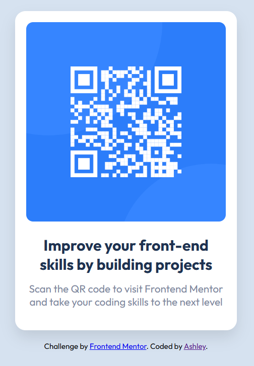

# Frontend Mentor - QR code component solution

This is a solution to the [QR code component challenge on Frontend Mentor](https://www.frontendmentor.io/challenges/qr-code-component-iux_sIO_H). Frontend Mentor challenges help you improve your coding skills by building realistic projects. 

## Table of contents

- [Overview](#overview)
  - [Screenshot](#screenshot)
  - [Links](#links)
- [My process](#my-process)
  - [Built with](#built-with)
  - [What I learned](#what-i-learned)
  - [Continued development](#continued-development)
  - [Useful resources](#useful-resources)
- [Author](#author)
- [Acknowledgments](#acknowledgments)

## Overview

This is my solution to the QR code component challenge from Frontend Mentor. The goal was to build a simple, responsive card that displays a QR code and clean typography. I focused on semantic HTML, accessibility, and styling with Flexbox.

### Screenshot



### Links

- Live Site URL: [View my solution live](https://www.frontendmentor.io/solutions/responsive-qr-code-card-with-flexbox-R_E_ZJUbLj)
- Solution URL: [View my solution here](https://ashurely321.github.io/qr-code-component-main/)

## My process

I started by reviewing the design on Frontend Mentor and identifying the key layout elements: a centered card, a QR code image, and clean typography. I built the HTML structure first, focusing on semantic tags and accessibility (like proper  text).
Then I styled the component using Flexbox to center it both vertically and horizontally. I used custom CSS properties to keep my colors and spacing consistent, and tested responsiveness by resizing the browser.
When I tried to add my screenshot to the README, it didn’t show up in the preview. I realized the filename in the Markdown didn’t match the actual image — the template had , but my file was a . I renamed the image to something simpler () and updated the Markdown path. That solved it! It was a small hiccup, but it helped me understand how Markdown links work and how VS Code handles file references.
Throughout the build, I kept my code clean and readable, with comments to explain my choices. I also made sure my final screenshot reflected the actual layout and styling I implemented.

### Built with

- HTML5 – Semantic structure and accessibility
- CSS3 – Styling and layout
- Flexbox – For responsive alignment
- VS Code – Code editor
- Live Server – Local development preview
- GitHub – Version control and hosting
- Markdown – For documentation

### What I learned

- How to work from a starter template
I began with the provided challenge files and learned how to extract the structure, styles, and assets I needed. I carefully reviewed the existing content to understand what to keep, what to replace, and how to make it my own.
- How to create a GitHub repo and connect it with my local project
I practiced the full Git workflow: initializing a local repo, creating a remote on GitHub, and linking them with . I pushed my changes confidently and verified that everything synced correctly.
-How to troubleshoot CSS layout issues
I adjusted padding, margins, and alignment until my layout matched the design preview. I used browser tools to inspect elements and tweak styles until the QR code component looked just right.
- How to add a screenshot to my README
My first attempt didn’t work — the image didn’t show up in preview. I realized the filename and extension didn’t match the Markdown reference. After renaming the file to something simpler and updating the path, the image displayed perfectly. That small fix taught me how Markdown handles file links and how VS Code previews work.
- How to create a JavaScript placeholder function — even though this project didn’t require JavaScript, I practiced writing a basic function to show where future interactivity could go. It helped me understand syntax and how to structure reusable code blocks.

### Code I'm Proud Of

```html
<main class="card">
  
  <h1>Improve your front-end skills by building projects</h1>
  <p>Scan the QR code to visit Frontend Mentor and take your coding skills to the next level</p>
</main>
```
```css
.card {
  background-color: var(--white);
  padding: 24px;
  border-radius: 16px;
  display: flex;
  flex-direction: column;
  align-items: center;
  max-width: 320px;
}
```
```js
// Placeholder for future interactivity
const showQRCode = () => {
  console.log('QR code component loaded');
}
```
### Continued development

I want to keep improving my CSS skills, especially with Flexbox and layout troubleshooting. I’m getting better at making things look right, but I still want to understand why certain spacing or alignment issues happen and how to fix them faster.
I also want to learn more about responsive design and how to make layouts work well on different screen sizes. As I build more projects, I’ll keep practicing clean structure, consistent styling, and accessibility.

### Useful resources

- [CSS Flexbox Layout Guide – CSS-Tricks]
(https://css-tricks.com/snippets/css/a-guide-to-flexbox/) - his guide helped me understand how Flexbox works and how to use it to center and align elements. I really liked the visual examples and clear breakdown of each property — I’ll definitely use this pattern going forward
- [Managing Remote Repositories – GitHub Docs](https://docs.github.com/en/get-started/git-basics/managing-remote-repositories) - - This article walked me through the process of linking my local project to a GitHub repo using git remote. It cleared up a lot of confusion I had about pushing and syncing changes. I’d recommend it to anyone still learning Git basics.

## Author

- GitHub – [Ashurely321](https://github.com/Ashurely321)
- Frontend Mentor – [Ashurely321](https://www.frontendmentor.io/profile/Ashurely321)

## Acknowledgments

- Frontend Mentor - for providing the challenge and design files that helped me practice real-world HTML and CSS skills
- CSS-Tricks - for their Flexbox guide, which helped me understand layout and alignment
- GitHub Docs – for clear instructions on setting up a remote repo and pushing my project
- VS Code – for being a reliable and beginner-friendly code editor with helpful preview tools
- My own persistence and curiosity – for sticking with the process, troubleshooting layout issues, and learning through trial and error


